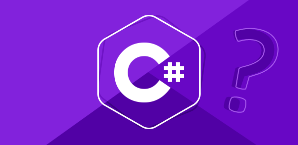
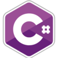
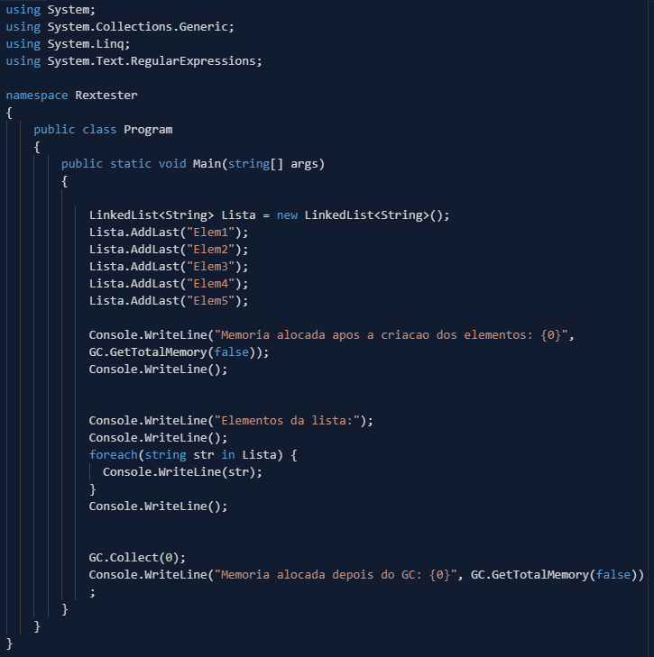
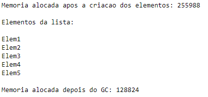
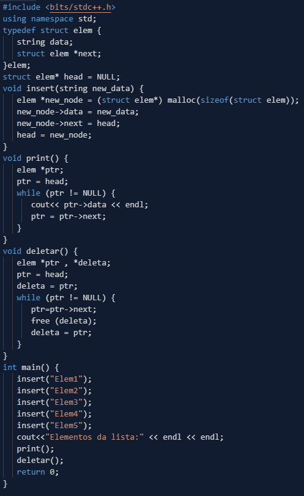
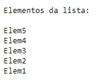
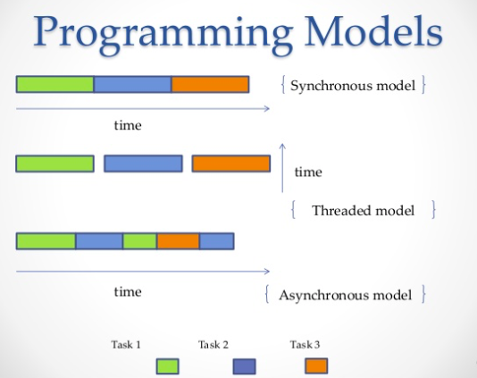
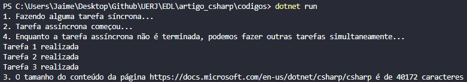
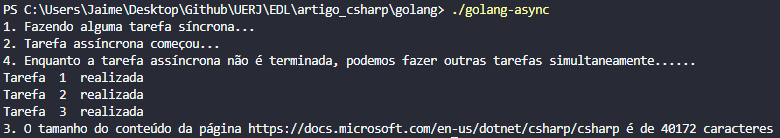

- [Introdução](#introdu%c3%a7%c3%a3o)
- [Classificação](#classifica%c3%a7%c3%a3o)
- [Funcionalidade: Garbage Collection](#funcionalidade-garbage-collection)
- [C# vs C++](#c-vs-c)
  - [Output](#output)
  - [Output](#output-1)
- [Funcionalidade: Async/Await](#funcionalidade-asyncawait)
- [C# vs GoLang](#c-vs-golang)
  - [Output](#output-2)
  - [Output](#output-3)
- [Referências](#refer%c3%aancias)

# Introdução
* Desenvolvida no ano 2000 por um time de desenvolvedores da Microsoft liderada por Anders Hejlsberg.
* Faz parte da plataforma .NET
    * Plataforma única de desenvolvimento e execução de sistemas e aplicações. Todo e qualquer código gerado para .NET pode ser executado em qualquer dispositivo que possua tal framework. 
* Baseado em linguagens como C, C++, JAVA e VB.
* Possui código fonte compilado para Common Intermediate Language (CIL) e que é interpretada pela máquina virtual Common Language Runtime(CLR).

# Classificação
* Orientada a Objetos
* Fortemente Tipada
* Fácil de aprender mas complexa.
* Linguagem de propósito geral
  * Desenvolvimento de Jogos
  * Desenvolvimento Web
  * Desenvolvimento Mobile
  * IoT
  * entre outros….

# Funcionalidade: Garbage Collection
É um recurso que oferece o gerenciamento de memória. Com ele é possível recuperar uma área inutilizada por um programa,evitando problemas de vazamento. Em linguagens que não tem o GC como C e C++, a memória dinâmica é alocada e desalocada explicitamente.
No caso do C#, toda vez que você cria um novo objeto, o CLR aloca memória para ele. Quando não há nenhuma referência à esse objeto, o GC recupera a parte da memória que estava sendo usada.

# C# vs C++



## Output





## Output


# Funcionalidade: Async/Await
Para podermos fazer tarefas simultaneamente, sem que o nosso programa pare e aguarde cada tarefa ser finalizada para realizar a próxima tarefa, temos que usar funções assíncronas. Como por exemplo, quando fazemos uma requisição a algum serviço web, ela certamente é mais demorada que qualquer operação local, e se ela for feita de maneira síncrona a página ficará congelada enquanto a resposta não chegar. Cada linguagem tem uma maneira diferente de implementar o assincronismo, e o  C# utiliza Tasks e Async/Await.


# C# vs GoLang


```csharp
using System;
using System.Net.Http;
using System.Threading.Tasks;

namespace codigos{
    class Program{
        private const string URL = "https://docs.microsoft.com/en-us/dotnet/csharp/csharp";
        static void Main(string[] args){
            doSyncTask();
            var someTaskAsync = doAsyncTask();
            doSyncTaskWhileAwait();
            someTaskAsync.Wait(); // Isso é uma "blocking call", faz com que o bloco não termine até a Tarefa ser realizada.
        }
        static void doSyncTask(){ Console.WriteLine("1. Fazendo alguma tarefa síncrona..."); } 
        static async Task doAsyncTask(){
            Console.WriteLine("2. Tarefa assíncrona começou...");
            await getTotalSizeOfContent();
        }
        static async Task getTotalSizeOfContent(){
            using (var httpClient = new HttpClient()){
                string result = await httpClient.GetStringAsync(URL); // execução para aqui até o GetStringAsync finalizar
                // Apartir dessas linhas abaixo, a execução só irá acontecer após o término da requisição
                Console.WriteLine($"3. O tamanho do conteúdo da página {URL} é de {result.Length} caracteres");
            }
        }
        static void doSyncTaskWhileAwait(){
            Console.WriteLine("4. Enquanto a tarefa assíncrona não é terminada, podemos fazer outras tarefas simultaneamente...");
            for (var i = 1; i <= 3; i++)
                Console.WriteLine($"Tarefa {i} realizada");
        }
    }
}

```
## Output



```golang
package main

import (
	"fmt"
	"io/ioutil"
	"net/http"
)

func doAsyncTask(url string, ch chan<- string) {
	resp, _ := http.Get(url)
	body, _ := ioutil.ReadAll(resp.Body)
	ch <- fmt.Sprintf("3. O tamanho do conteúdo da página %s é de %d caracteres", url, len(body))
}

func doSyncTask() {
	fmt.Println("1. Fazendo alguma tarefa síncrona...")
}

func doSyncTaskWhileAwait() {
	fmt.Println("4. Enquanto a tarefa assíncrona não é terminada, podemos fazer outras tarefas simultaneamente......")
	for i := 1; i <= 3; i++ {
		fmt.Println("Tarefa ", i, " realizada")
	}
}

func main() {
	doSyncTask()
	ch := make(chan string)
	fmt.Println("2. Tarefa assíncrona começou...")
	go doAsyncTask("https://docs.microsoft.com/en-us/dotnet/csharp/csharp", ch)
	doSyncTaskWhileAwait()
	fmt.Println(<-ch)
}
```

## Output


# Referências
1. https://medium.com/sololearn/why-is-c-among-the-most-popular-programming-languages-in-the-world-ccf26824ffcb
2. https://www.youtube.com/watch?v=NXVQasys0B8
3. https://www.quora.com/Where-is-C-used
4. https://www.codingame.com/playgrounds/4240/your-ultimate-async-await-tutorial-in-c/introduction
5. https://docs.microsoft.com/pt-br/dotnet/standard/garbage-collection/fundamentals
6. https://www.codingame.com/playgrounds/6179/garbage-collection-and-c
7. https://docs.microsoft.com/pt-br/dotnet/api/system.gc?view=netframework-4.8
8. https://www.devmedia.com.br/garbage-collection-entendendo-e-otimizando-parte-1/24082
9. https://www.geeksforgeeks.org/linked-list-implementation-in-c-sharp/
10. https://www.codementor.io/codementorteam/a-comprehensive-guide-to-implementation-of-singly-linked-list-using-c_plus_plus-ondlm5azr
11. https://blog.narenarya.in/concurrent-http-in-go.html

